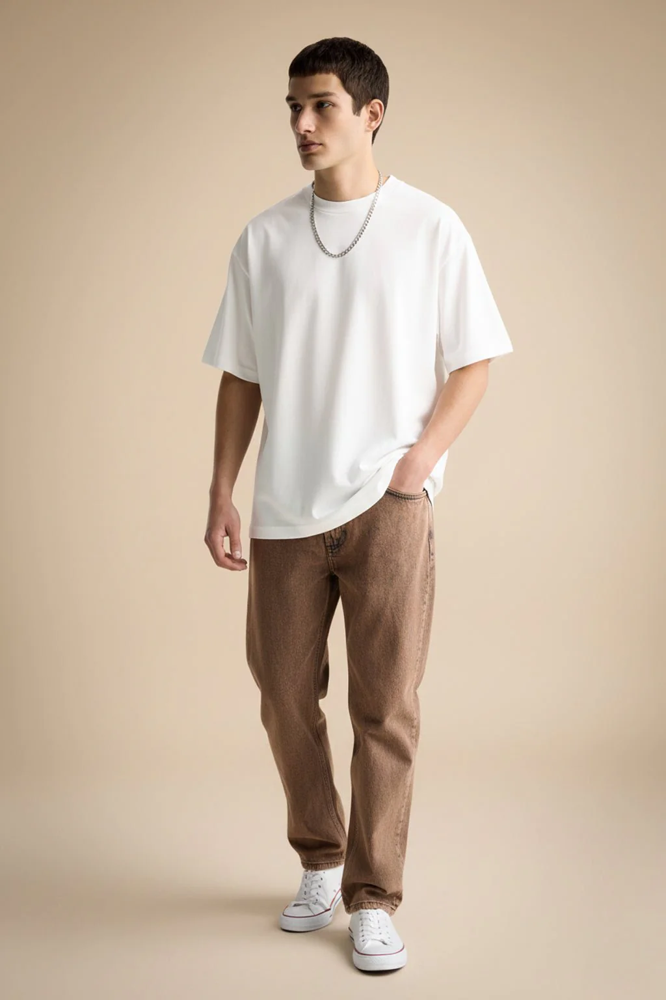
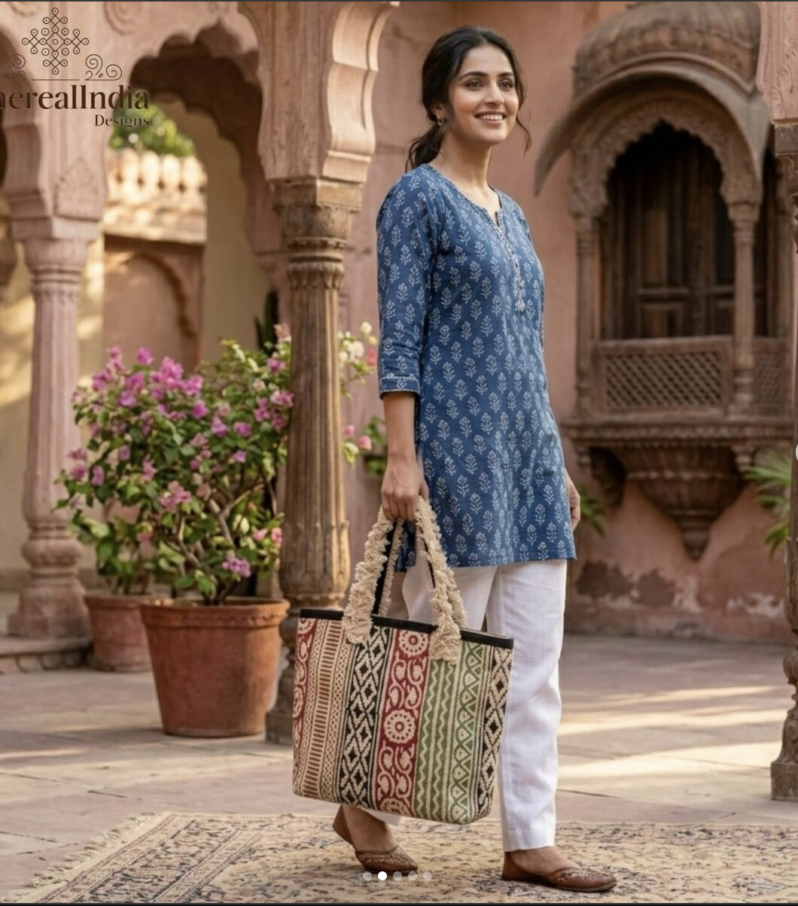
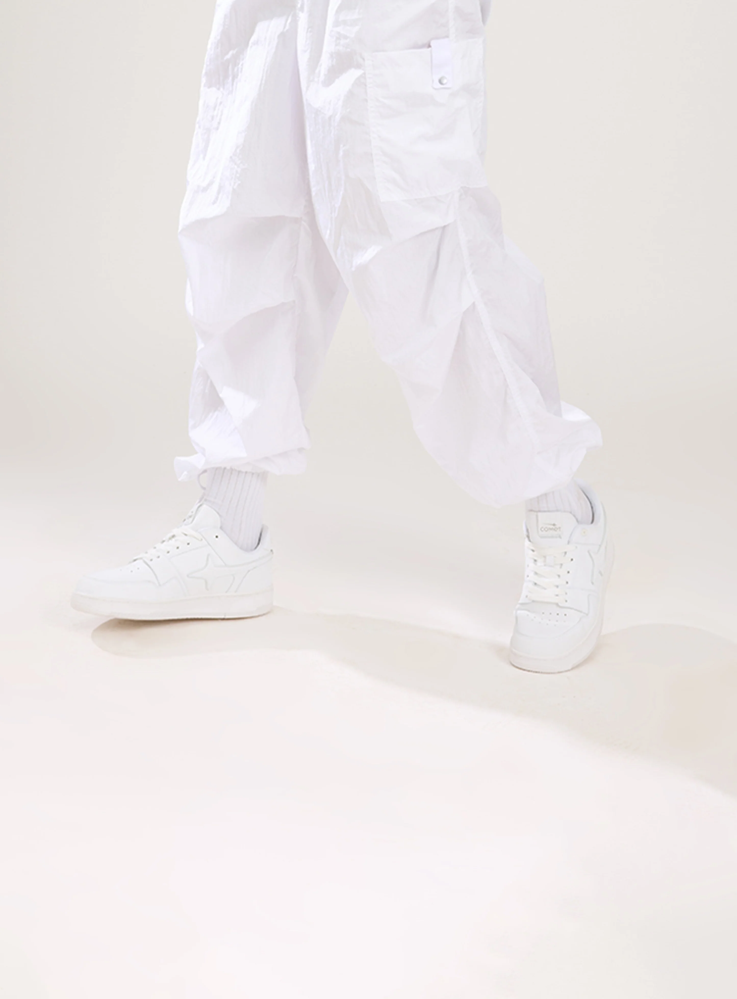
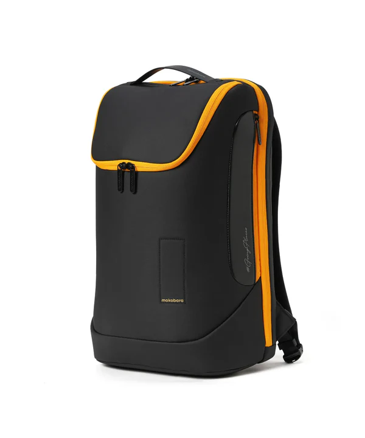
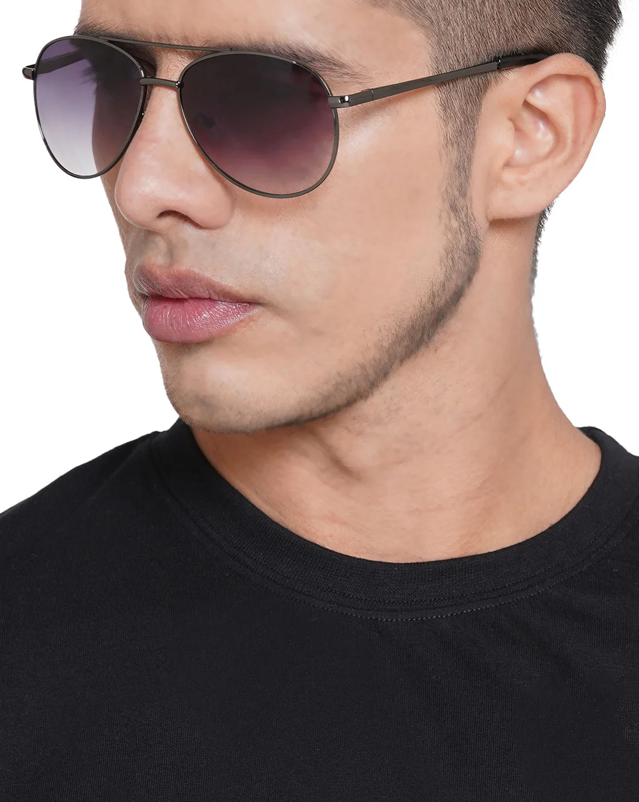

# CurateAI — Demo Queries & Evaluator Test Guide

> Use this doc to run through all five user scenarios during the Loom recording or evaluator demo.
> OTP for all registered numbers: **1234**
> All test images go in `curateai/test_media/` and are linked below.

---

## Folder structure

```
curateai/test_media/
  s1_new_user_no_profile/
  s2a_midchat_rich/
  s2b_midchat_poor/
  s2c_midchat_unregistered/
  s3_returning/
```

Drop your images into the right subfolder and rename them to match the filenames below exactly.

---

## Scenario 1 — New User, Phone Given Upfront, No GoKwik Profile

**Who:** First-time shopper on GoKwik network. Phone entered and OTP verified at the start, but GoKwik has no purchase history, no preferred payment, no rewards.

**Phone to use:** `7777000001` (not in system — will cold-start)
**OTP:** `1234` (always)

**What to expect:** Agent greets warmly after OTP, but with no personalisation — no wallet mentions, no preferred card, network offer shown as generic best deal. Guest flow for checkout.

---

### S1-A — Single item, text

**Steps:**
1. Open app → enter phone `7777000001` → OTP `1234` → verified (new user, no data)
2. Type in chat:

```
I'm looking for a clean white oversized tee — something I can style casually
```

3. Agent surfaces 2–3 white/oversized topwear options from catalog
4. Pick one → agent shows price card (generic best offer, no wallet, prepaid nudge only)
5. Proceed to checkout → "Add delivery details" box → fill phone + address → Save

**Expected highlights:**
- No loyalty wallet mention (zero balance)
- No preferred payment pre-selected (no profile)
- Generic network offer shown as best deal
- Checkout shows "Tap to add phone & address" box (no pre-fill)

---

### S1-B — Multi-item, image

**Image needed:** Drop a full streetwear outfit image (tee + cargo pants + sneakers) into:

```
test_media/s1_new_user_no_profile/s1b_streetwear_look.jpg
```



**Steps:**
1. Open app → enter phone `7777000001` → OTP `1234`
2. Upload the image. No text needed (or optionally add: *"Can you find this look?"*)
3. Agent identifies 2–3 items (e.g., graphic tee + cargo/jogger + sneakers)
4. Agent asks: *"Want the full look or just one piece?"* → choose full look
5. Agent walks through each item conversationally, shows price cards
6. At end, agent shows Look Summary with single checkout CTA

**Expected highlights:**
- Vision correctly breaks out individual items from the look
- No wallet applied (zero balance)
- Look summary shows itemised breakdown with total

---

## Scenario 2A — Mid-Chat Phone, User Exists with Rich Profile

**Who:** Shopper who skipped the upfront OTP and jumped straight into browsing. When the agent nudges for phone mid-chat, they share it — and GoKwik recognises them with a full profile.

**Phone to share mid-chat:** `8800000001`
**Name:** Zara H · Gold · HDFC Credit Card · ₹750 in rewards (Caprese ₹450, Giva ₹200, Zouk ₹100)
**RTO:** Low · COD eligible

**What to expect:** After phone is shared, personalisation kicks in — HDFC deal surfaced, rewards shown per merchant, prepaid not forced (low RTO).

---

### S2A-A — Single item, text (phone shared mid-chat)

**Steps:**
1. Open app → **skip** OTP ("Browse as guest")
2. Type:

```
Looking for a nice leather-look handbag — something structured, not too big
```

3. Agent shows bags from catalog
4. At this point, agent should nudge for mobile number (within first 2 exchanges)
5. User shares: `8800000001` (type in chat as a plain number or however the agent asks)
6. Profile loads silently — agent picks up naturally
7. Agent now re-surfaces or updates price card with HDFC offer + Caprese/Zouk wallet visible
8. User adds to cart → checkout shows Zara's profile pre-filled with HDFC card

**Expected highlights:**
- Agent nudge for phone is polite, not pushy
- Profile loads invisibly (no "Identity Verified" announcement)
- HDFC offer + ₹450 Caprese wallet visible on checkout

---

### S2A-B — Multi-item, image + text (phone shared mid-chat)

**Image needed:** Drop a casual ethnic look (printed kurta + palazzos or straight pants + kolhapuris or flats — everyday ethnic, not bridal) into:

```
test_media/s2a_midchat_rich/s2a_ethnic_look.jpg
```



**Steps:**
1. Open app → skip OTP
2. Upload image with text:

```
Find me this look
```

3. Agent identifies 3+ items (ethnic top, bottom, footwear)
4. Agent asks single vs full look → choose full look
5. Mid-conversation, agent nudges for phone → share `8800000001`
6. Profile loads; remaining items priced with HDFC + rewards visible
7. Look summary → single checkout link

**Expected highlights:**
- Vision + text handled in one prompt
- Personalisation enriches pricing mid-conversation (not just at checkout)
- Full look checkout CTA with HDFC offer on cart total

---

## Scenario 2B — Mid-Chat Phone, User Exists but Sparse Profile

**Who:** Registered GoKwik user but light history. No merchant rewards accumulated, medium RTO risk, no strong payment signal.

**Phone to share mid-chat:** `9090909090`
**Name:** Varun N · Silver · PhonePe UPI · ₹100 Bewakoof wallet
**RTO:** Medium · COD eligible

**What to expect:** Profile loads but minimal uplift — PhonePe shown as preferred, only ₹100 Bewakoof wallet visible (only applies if they buy Bewakoof), no HDFC / network card deal.

---

### S2B-A — Single item, text (phone shared mid-chat)

**Steps:**
1. Open app → skip OTP
2. Type:

```
Looking for a relaxed cargo trouser — something I can dress up or down
```

3. Agent surfaces cargo trouser options (Bewakoof, SNITCH etc.)
4. Agent nudges for phone (within first response or next message) → share `9090909090`
5. Profile loads: PhonePe preferred, ₹100 Bewakoof wallet if applicable
6. Price card: if Bewakoof cargo is shown, ₹100 deducted; PhonePe shown as preferred UPI

**Expected highlights:**
- Minimal personalisation signal (sparse data)
- Wallet only applies to Bewakoof product — shown conditionally
- No HDFC/Kotak offer nudge; PhonePe shown as payment pick

---

### S2B-B — Single item, image (phone shared mid-chat)

**Image needed:** Drop a photo of a specific pair of sneakers (clean white, low-top) into:

```
test_media/s2b_midchat_poor/s2b_white_sneakers.jpg
```



**Steps:**
1. Open app → skip OTP
2. Upload the sneaker image. Add text (optional):

```
Find me something similar to this
```

3. Agent identifies white sneakers → surfaces 2–3 similar options (Campus, Neemans, Solethreads)
4. Agent nudges for phone → share `9090909090`
5. Profile loads: PhonePe preferred, minimal rewards
6. Price card shows PhonePe as best UPI pick, no big wallet saving

**Expected highlights:**
- Vision correctly identifies footwear type + colour
- Sparse profile → minimal wallet/payment uplift visible
- Good for showing contrast with 2A (same image scenario, very different personalisation)

---

## Scenario 2C — Mid-Chat Phone, Not on GoKwik Network Yet

**Who:** New-to-GoKwik shopper. Skipped OTP, chatted, then shared their number mid-chat. Number not found → registered silently, no data to pull.

**Phone to share mid-chat:** `7777000002` (not in system)

**What to expect:** Number collected, registered as new user, no personalisation. Agent continues as before — generic offers shown. Number stored for future GoKwik identity graph.

---

### S2C-A — Multi-item, text (phone shared mid-chat)

**Steps:**
1. Open app → skip OTP
2. Type:

```
Looking for a casual linen shirt and trouser combo — something relaxed but put-together
```

3. Agent identifies this as a multi-item request → surfaces linen shirt + trouser options
4. Agent asks single vs full look → choose full look
5. Agent nudges for phone → share `7777000002`
6. "Thanks! I'll remember you next time" — agent continues, no profile loaded (doesn't exist)
7. Price cards: generic best offer for each item, no wallet
8. Look summary → checkout

**Expected highlights:**
- Agent doesn't announce "profile not found" — handles gracefully
- Generic pricing throughout (no wallet, no preferred payment)
- Number registered silently for next visit

---

### S2C-B — Single item, image + text (phone shared mid-chat)

**Image needed:** Drop a photo of a backpack (casual/everyday style) into:

```
test_media/s2c_midchat_unregistered/s2c_backpack.jpg
```



**Steps:**
1. Open app → skip OTP
2. Upload image with text:

```
Something like this — find me a similar backpack
```

3. Agent identifies backpack → surfaces similar options (Mokobara, Zouk, Caprese)
4. Agent nudges for phone → share `7777000002` mid-conversation
5. Not found → registered → agent picks up naturally, no break in flow
6. Price shown without wallet; generic network offer if applicable

**Expected highlights:**
- Image + text handled together by vision model
- Graceful new-user registration (invisible to user)
- No personalisation uplift (contrast with 2A clearly visible)

---

## Scenario 3 — Returning User, Phone Auth Upfront

**Who:** Known GoKwik shopper. Enters phone at the start, completes OTP, full profile loaded before first message.

Two sub-profiles used here — pick one per test:

| | Phone | Name | Profile |
|--|--|--|--|
| **3-A** | `9876543210` | Adarsh B | Gold · HDFC CC · ₹275 rewards · low RTO |
| **3-B** | `9210001234` | Meera S | Gold · Kotak CC · ₹75 rewards (Zouk ₹75) · low RTO |

---

### S3-A — Single item, image (Adarsh, HDFC)

**Phone:** `9876543210` · OTP: `1234`

**Image:** `test_media/s3_returning/s3a_sunglasses.jpg`



**Steps:**
1. Open app → enter `9876543210` → OTP `1234`
2. Profile loaded silently. Agent greets naturally
3. Upload the sunglasses image. Add text (optional):

```
Find me something like this
```

4. Agent identifies sunglasses → surfaces 2–3 similar options (Fastrack, Giva etc.)
5. Price card: HDFC offer shown as preferred, merchant rewards if any brand matches
6. Add to cart → checkout: Adarsh's profile pre-filled (HDFC card, ₹275 wallet breakdown)

**Expected highlights:**
- Personalised greeting within first agent message
- Vision correctly identifies accessory type from image
- HDFC deal shown prominently on price card
- Checkout: identity card pre-filled, address row (no address → "Add delivery address")

---

### S3-B — Multi-item, image + text (Meera, Kotak + high rewards)

**Phone:** `9210001234` · OTP: `1234`

**Image:** `test_media/s3_returning/s3b_top_tote.png`


**Steps:**
1. Open app → enter `9210001234` → OTP `1234`
2. Profile loaded: Gold, Kotak CC, ₹75 Zouk wallet active
3. Upload the image with text:

```
Show me a casual top and a floral tote to go with it
```

4. Agent identifies 2 items from image + text → surfaces top options + floral/printed tote options
5. Agent: *"Want both or just one?"* → both
6. For the tote: Zouk prominently shown (Meera has ₹75 wallet there)
7. Look summary: Zouk ₹75 deducted, Kotak offer on cart total, single checkout CTA

**Expected highlights:**
- Zouk ₹75 wallet surfaced on the tote price card — personalisation in action
- Vision + text multi-ask resolved conversationally
- Full-look checkout: wallet + Kotak network offer both visible in breakdown
- Good for showing how GoKwik identity unlocks merchant-specific rewards

---

## Quick Reference — Phone Numbers

| Scenario | Phone | Name | Key Signal |
|----------|-------|------|-----------|
| S1 (new, no data) | `7777000001` | — | Cold start, no personalisation |
| S2A (rich profile) | `8800000001` | Zara H | HDFC ₹750 rewards, low RTO |
| S2B (sparse profile) | `9090909090` | Varun N | PhonePe, ₹100 wallet, medium RTO |
| S2C (not registered) | `7777000002` | — | Registers new, no data |
| S3-A (returning) | `9876543210` | Adarsh B | HDFC, ₹275 rewards |
| S3-B (returning) | `9210001234` | Meera S | Kotak, ₹75 rewards, Zouk ₹75 |

**OTP for all:** `1234`

---

## Image Checklist

Drop these into the corresponding `test_media/` subfolders before running the demo:

| File path | What to use |
|-----------|-------------|
| `test_media/s1_new_user_no_profile/s1b_streetwear_look.jpg` | Full streetwear outfit (tee + cargo + sneakers) |
| `test_media/s2a_midchat_rich/s2a_ethnic_look.jpg` | Casual ethnic look (printed kurta + palazzos/pants + kolhapuris or flats) |
| `test_media/s2b_midchat_poor/s2b_white_sneakers.jpg` | Clean white low-top sneakers |
| `test_media/s2c_midchat_unregistered/s2c_backpack.jpg` | Casual everyday backpack |
| `test_media/s3_returning/s3a_sunglasses.jpg` | Sunglasses — clean, versatile style ✅ |
| `test_media/s3_returning/s3b_top_tote.png` | Casual top + floral tote ✅ |

> Images do not need to be perfect catalog matches — the vision model will identify the items and match against the D2C catalog.
